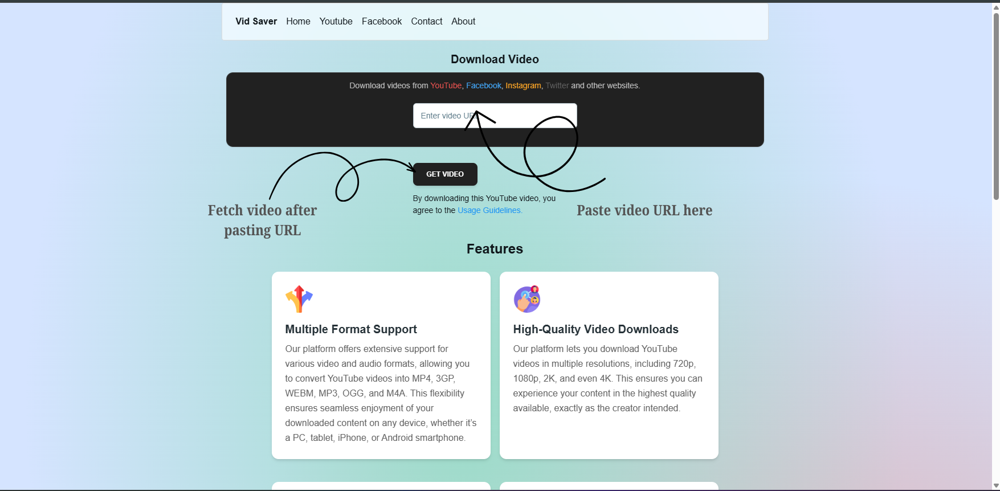
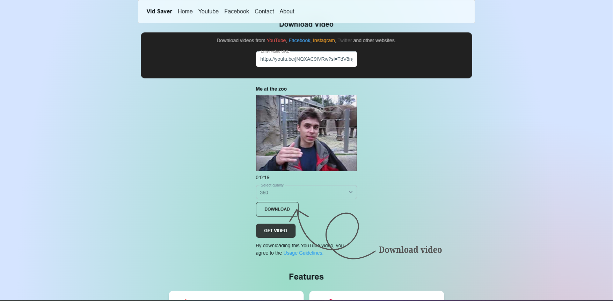

📥 Media Saver






Media Saver is a simple and fast web application that allows users to download videos, reels, shorts, from multiple social media platforms.
Built with React (frontend) and Node.js/Express (backend), it provides a clean UI and smooth experience for saving media in just a few clicks.

✨ Features

Download videos, reels, shorts, and images

Support for popular platforms (YouTube, Instagram, Facebook, X, etc.)

Lightweight and responsive UI

🚀 Tech Stack

Frontend: React, nextui(Tailwind)

Backend: Node.js + Express

Other: API integration for media extraction

🚀 How to Run the App

## 🚀 How to Run the App

### 1. Clone the repository

```bash
git clone https://github.com/Akshay7623/media-saver.git
cd media-saver
```

### 2. Build the frontend (React client)

```bash
cd client
npm install
npm run build
```

## ⚙️ Environment Variables

Before starting the server, create a `.env` file inside the **server** folder and set the following variables:

```bash
GOOGLE_APP_PASSWORD=your_google_app_password
CLOUDFLARE_SECRET_KEY=your_cloudflare_secret_key
MONGO_URI=your_mongodb_connection_string
SMTP_USERNAME=your_smtp_username
CONTACT_MAIL=your_contact_email
```


### 3. Start the backend (Express server)

```bash
cd ../server
npm install
node index.js
```


### 4. Access the application

Open your browser and go to:
http://localhost:5000